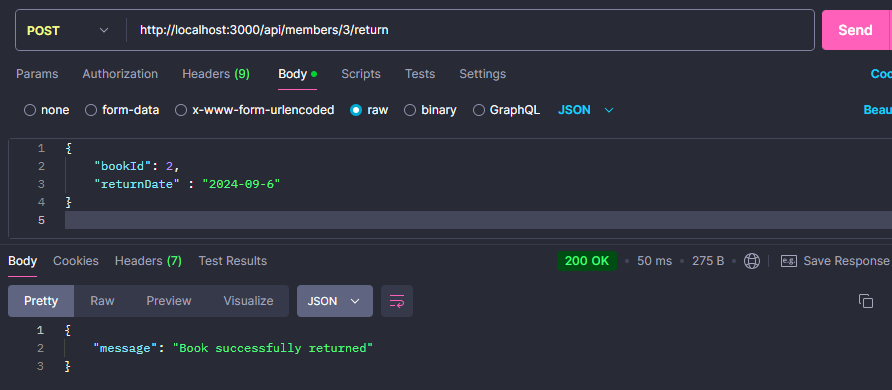

# Dokumentasi Aplikasi Perpustakaan

### Menu CRUD Member

##### 1. Buat Member

Fitur ini memungkinkan Anda menambahkan anggota baru ke sistem perpustakaan. Informasi yang dimasukkan termasuk nama anggota, detail kontak, dan jenis keanggotaan.

##### 2. Hapus Member

Fitur hapus member memungkinkan Anda menghapus anggota dari sistem. Setelah dihapus, semua informasi terkait anggota tersebut akan dihapus secara permanen.

##### 3. Ambil Data Semua Member

Opsi ini memungkinkan Anda melihat detail semua anggota yang saat ini terdaftar di sistem perpustakaan, memberikan gambaran menyeluruh tentang pengguna aktif.

##### 4. Ambil Data Member Berdasarkan ID

Fitur ini memungkinkan Anda mencari informasi spesifik dari anggota berdasarkan ID uniknya. Berguna untuk pencarian yang lebih terarah.

##### 5. Perbarui Data Member

Fitur ini memungkinkan Anda memperbarui informasi anggota yang sudah ada, seperti mengubah detail kontak atau memperbarui jenis keanggotaannya.

## 

### Menu CRUD Buku

##### 1. Tambah Buku

Fitur tambah buku memungkinkan Anda menambahkan buku baru ke katalog perpustakaan. Informasi yang dimasukkan termasuk judul, penulis, ISBN, dan genre.

##### 2. Hapus Buku

Fitur ini memungkinkan Anda menghapus buku dari sistem. Setelah dihapus, buku tersebut tidak lagi tersedia dalam inventaris perpustakaan.

##### 3. Ambil Data Semua Buku

Opsi ini memungkinkan Anda melihat daftar lengkap semua buku yang tersedia di perpustakaan, memberikan gambaran tentang katalog buku.

##### 4. Ambil Data Buku Berdasarkan ID

Fitur ini memungkinkan Anda mencari informasi buku spesifik berdasarkan ID uniknya, memberikan detail lengkap tentang buku tersebut.

##### 5. Perbarui Data Buku

Fitur ini memungkinkan Anda memperbarui informasi dari buku yang ada, seperti status ketersediaan, judul, atau metadata lainnya.

---

### Menu CRUD Peminjaman

##### 1. Buat Peminjaman

Fitur ini memungkinkan Anda membuat peminjaman baru untuk anggota perpustakaan. Informasi yang dimasukkan termasuk ID buku, ID anggota, dan tanggal peminjaman.

##### 2. Ambil Data Peminjaman

Fitur ini memungkinkan Anda melihat semua transaksi peminjaman yang sedang berjalan. Informasi ini berguna untuk memantau buku yang sedang dipinjam.

##### 3. Ambil Data Pengembalian

Fitur ini memungkinkan Anda melihat semua transaksi pengembalian buku di perpustakaan. Anda dapat melacak buku yang sudah dikembalikan oleh anggota.

##### 4. Pengembalian Melebihi Batas Waktu

Fitur ini membantu Anda melacak buku-buku yang dikembalikan setelah batas waktu yang ditentukan, serta mencatat denda jika ada.

##### 5. Pengembalian Sesuai dan Tidak Melebihi Batas Waktu

Fitur ini memungkinkan Anda membedakan buku yang dikembalikan sesuai batas waktu dan yang melebihi batas waktu, memberikan informasi yang lebih rinci terkait status pengembalian.

